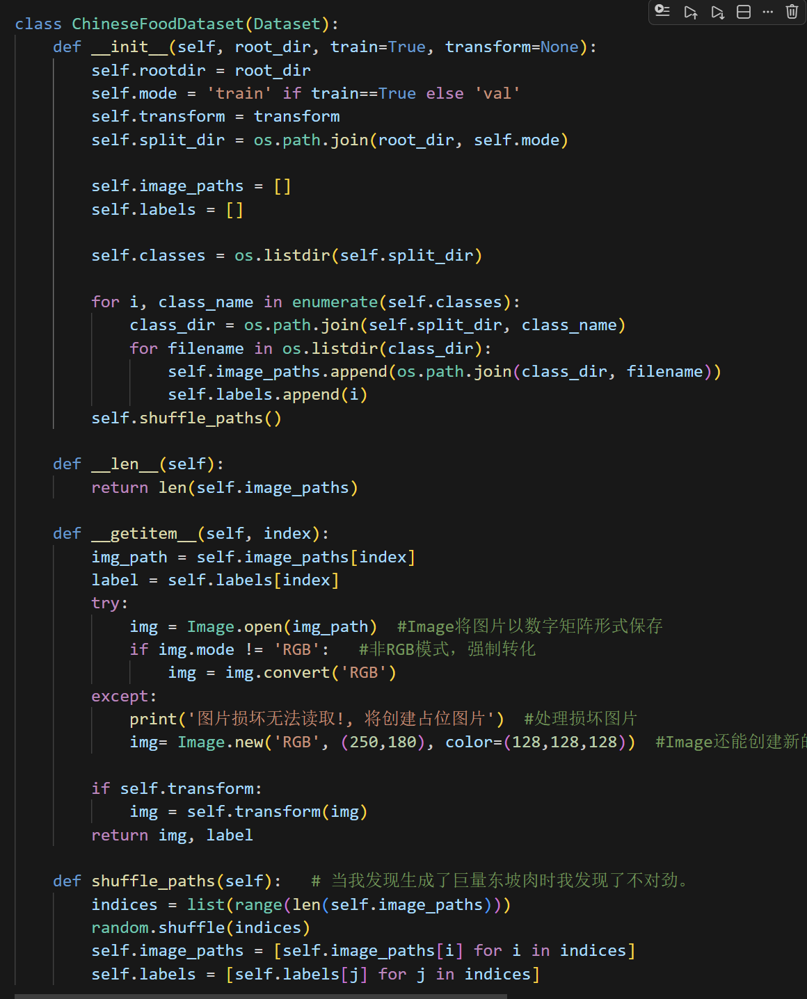
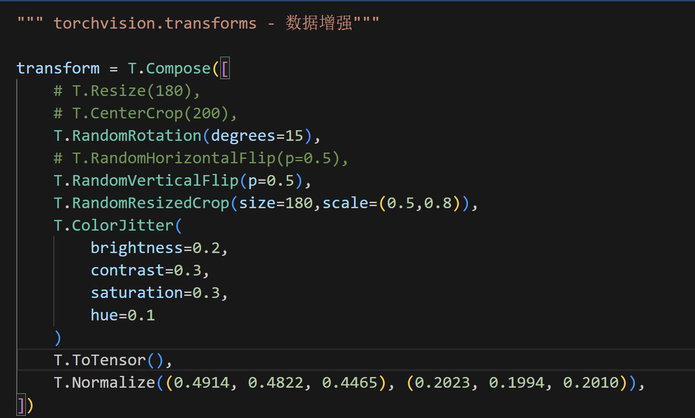
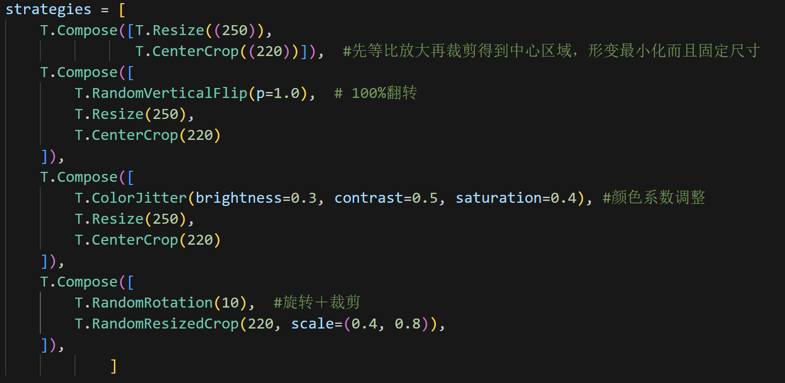
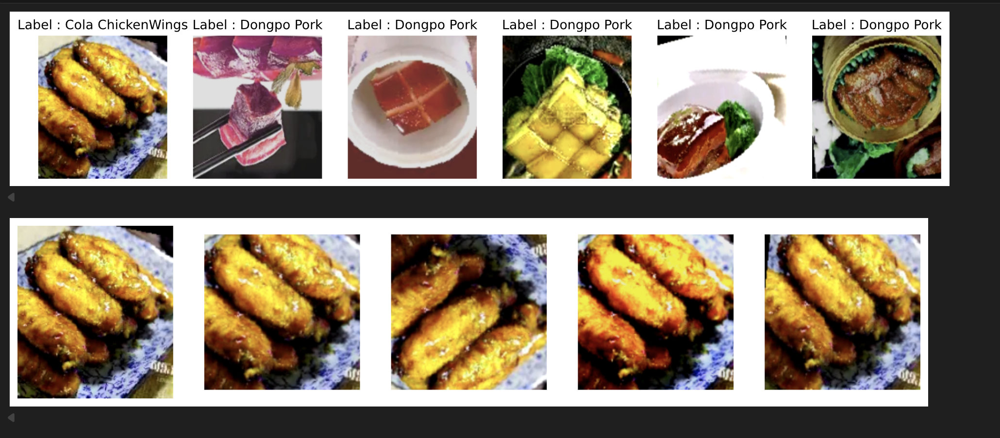

# *关于 **自定义图像数据加载器** 作业的综述*

## **数据集概述**

我构建了**中华经典美食**的数据集，数据来源于**Bing搜索引擎**，包含了**东坡肉，麻婆豆腐，可乐鸡翅**三类图片，**训练集**和**验证集**分别是**40张**和**20张**图片

## **CustomDataset 类代码展示**

图片读取用的是 *Image* 的 *open* 方法；处理异常值采用Image对象的 *convert*，将非RGB形式的值转为RGB模式；对于无法读取的图片，用 **纯灰图片占位**

## **Transforms配置**

我还没去学CV的那些更高级的特征增强策略，只用了最**基础的方法(如图一)**, 接着我对第一张图片进行**多样的增强策略效果对比(如图二)**，包括中心裁剪，翻转裁剪，色彩变化裁剪，随机旋转与裁剪，**图三即对比效果**

## **踩坑**

其实没遇到脏数据的情况。。？但是有踩其他坑，比如用 **bing的search页面去get只能得到很少的图**，用 *async* 接口就能从*简化后的 html* 中快速，清晰地得到图片，还有 **得出的大量图片重复**，去重的方法搜了ai，还有**生成巨量东坡肉**，因为是按顺序生成的图像路径，后面补了**打乱操作**。